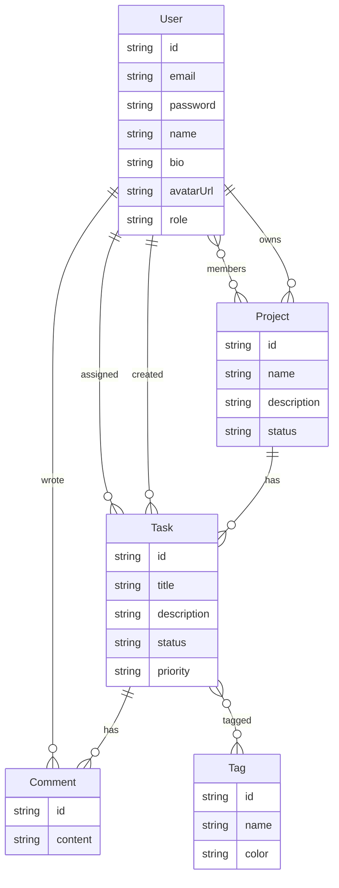

```mermaid
erDiagram
  User {
    string id
    string email
    string password
    string name
    string bio
    string avatarUrl
    string role
  }

  Project {
    string id
    string name
    string description
    string status
  }

  Task {
    string id
    string title
    string description
    string status
    string priority
  }

  Comment {
    string id
    string content
  }

  Tag {
    string id
    string name
    string color
  }

  User ||--o{ Project : owns
  User }o--o{ Project : members
  Project ||--o{ Task : has
  User ||--o{ Task : created
  User ||--o{ Task : assigned
  Task ||--o{ Comment : has
  User ||--o{ Comment : wrote
  Task }o--o{ Tag : tagged
```

